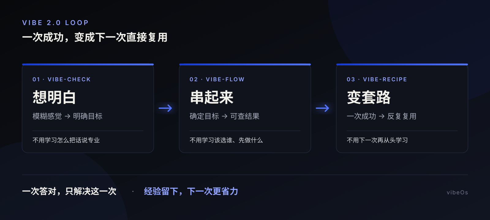

# vibeOs

[](protocol/) [](skills/) [](tests/) [](LICENSE)

**让你少折腾学习，直接把你的经验变成一键搞定的专属 AI 工具。**

> **不是只有伟大的开创者，才能让人们看见新的可能。**

> Vibe 2.0：AI 引导意图，人做决策，AI 执行，把模糊变成具体。

AI 1.0 没有消灭学习成本，只是把它转移给了人：先学怎么提问，再学选哪个工具，做成一次以后，下次还得重新来。

vibeOs 把这件事反过来。你先说一句大白话，AI 陪你把目标想明白、把合适的工具串起来，再把这次成功变成下次可以直接套用的办法。

> **我们以为自己在学习 AI，真正好的 AI 应该先学会理解我们。**



## 复制一句话，直接安装

复制下面的内容，粘贴到你常用的 AI 对话框：

```text
https://github.com/AdgaiWalker/vibeOs
帮我安装技能
```

AI 会先检查兼容性、安装位置和同名冲突，等你确认后再开始；完成后按它给出的提示使用。

## AI 1.0 真正昂贵的地方

问题不是 AI 不会做，而是每次开始之前，人都要先把自己训练成半个专家。

| 你原本要学什么 | AI 1.0 | Vibe 2.0 |
| --- | --- | --- |
| 怎么把需求说专业 | 自己研究提示词，反复试哪句话有效 | `$vibe-check` 用简单对比帮你把目标想明白 |
| 该选谁、先做什么 | 自己看工具文档、拼流程、来回复制上下文 | `$vibe-flow` 只挑真正需要的工具并安排执行 |
| 怎样复制一次成功 | 靠记忆保存提示词，下次再重新调试 | `$vibe-recipe` 找出不变步骤和可替换部分 |

这三件事消灭的不是人的判断，而是不应该由人反复承担的认知成本。你仍然决定“我要什么”和“这样算不算做好”；AI 负责观察、组织、执行和记录。

> **一次答对，只解决这一次；把经验留下来，才能让以后每一次越来越省力。**

## 三个动作，一条路

```text
想明白（vibe-check） → 串起来（vibe-flow） → 变套路（vibe-recipe）
```

### `vibe-check`：想明白

当你说“我想要高级一点”“感觉不对，但我说不清”时，它不会丢给你一张长问卷。它会先看现状，再给出几个能看懂的方向，每次只问一个真正影响结果的问题。

最后得到的不是一堆漂亮形容词，而是一个 AI 不需要继续猜测的目标：要什么、不要什么、怎样才算做好。

```text
使用 $vibe-check，和我聊聊把“这个首页想更有信任感，但不要太严肃”想成清晰的具体需求。
```

### `vibe-flow`：串起来

当事情需要多个工具时，你不需要知道每个工具叫什么、谁先谁后。它会删除没有独特价值的工具，安排必须先完成的工作，也会把互不影响的部分同时推进。

中途发现方向不对，只重做受影响的部分，不让整个任务推倒重来。

```text
使用 $vibe-flow，帮我把这个网站从想法推进到可以打开、可以检查的成品。
```

### `vibe-recipe`：变套路

当一次任务做成功后，它会继续追问：这次成功，哪些是偶然，哪些下次还能继续用？

它会把方法整理成 AI 能直接执行的菜谱，标出可以替换的“食材”和不能省略的步骤，再换一个真实任务试跑。只有别人拿到后也能用，这份菜谱才算完成。

```text
使用 $vibe-recipe，把这次做成官网的方法变成换个项目也能直接套用的 AI 菜谱。
```

已经想得很清楚？直接从 `$vibe-flow` 开始。只是一次性小事？做完就停，不必强行保存成菜谱。

## 看一个完整例子

假设你只知道：“我想把 README 写得更吸引小白，但又不想变成夸张广告。”

| 阶段 | 发生什么 | 你得到什么 |
| --- | --- | --- |
| `vibe-check` | 找出真正影响结果的选择：读者是谁、第一眼记住什么、哪些表达不能丢 | 一份不会让执行者猜方向的目标 |
| `vibe-flow` | 选择需要的文档、产品、视觉和验证能力，安排读取、重写、检查 | 一份可以直接发布和验收的 README |
| `vibe-recipe` | 回看这次为什么做成，分离固定原则与项目变量，再用另一个仓库测试 | 一份其他项目也能复用的 README 菜谱 |

Prompt 解决这一次，Recipe 复用每一次。

## 三步开始

### 1. 说出困扰

```text
使用 $vibe-check，帮我把这个还说不清的想法理明白；每次只问我一个真正影响结果的问题。
```

### 2. 说“帮我做完”

```text
使用 $vibe-flow，自己选择合适的工具、安排顺序，把这件事推进到可以检查的结果。
```

### 3. 说“把它存下来”

```text
使用 $vibe-recipe，把这次成功变成换个参数也能复用的 AI 菜谱，并用真实任务验证。
```

## 你仍然拥有最后决定权

Vibe 2.0 的“自动”不是让 AI 替你决定人生。

| AI 可以替你做 | 必须由你决定 |
| --- | --- |
| 查看现状、整理信息、发现遗漏 | 你真正想要什么 |
| 推荐方向并解释差别 | 哪种取舍更像你 |
| 挑选工具、安排执行、检查结果 | 哪些东西不能改、哪些风险不能接受 |
| 保存已经验证过的方法 | 最终结果是否通过 |

**AI 帮你看得更多、做得更快，但不会偷偷拿走你的选择权。**

## 证据，而不是口号

仓库里的测试会检查三件套能否安装、识别和卸载，也会检查三个 Skill 的身份、交接规则和案例证据是否一致。

```bash
make test
```

现有证据证明，这套流程可以把一次真实任务记录成可追踪、可检查的过程。它还不能证明所有人都一定会节省时间、减少 Token 或得到更好的作品；这些结论必须来自更多真实任务和可比较的数据。

- [Agency Protocol v0.1](protocol/)：人与 AI 各自负责什么。
- [Agency Contract v0.1](contracts/)：任务换人或换工具时，怎样不丢上下文。
- [评估记录](evals/)：怎样区分事实、观察和暂时无法证明的主张。
- [真实案例](cases/001-readme-rewrite.md)：一次 README 任务怎样被记录和复盘。

<details>
<summary><strong>查看仓库结构</strong></summary>

```text
vibeOs/
├── skills/
│   ├── vibe-check/          # 想明白
│   ├── vibe-flow/           # 串起来
│   └── vibe-recipe/         # 变套路
├── protocol/                # 人与 AI 的协作规则
├── contracts/               # 交接时共同使用的信息
├── cases/                   # 真实案例
├── evals/                   # 检查方法与结果
├── scripts/                 # 安装、检查和卸载
└── tests/                   # 自动测试
```

</details>

## License

[MIT](LICENSE)
