# Agency-Craft 当前更新基线审计

日期：2026-07-31

## 审计范围

- 当前分支、未提交差异与最近提交
- 六个官网章节
- 桌面视口：1440 × 1024
- 手机视口：390 × 844
- 闸门选择状态与页面控制台
- 新增 Vibe-Flow 定向测试

## 总体结论

这次更新改变了 Agency-Craft 的方法论与证据基础，没有改变官网前端。`src/`、`public/` 和构建配置没有差异，六个章节的视觉、WebGL 影像和响应式行为与上一基线一致。

因此：

1. 上一轮视觉审计仍然有效。
2. 上一轮三个视觉方案的内容依据已经过期，不应继续要求用户从中选择。
3. 应只重开受新证据影响的内容与交互隐喻，不必从头推翻银灰钴蓝材质、六章节结构或互动影像身份。

## 新证据

- Flow gate 已从“技能选择与排序”扩展为：条件化多范畴第一性推演、分歧证据任务、一条或多条主要矛盾线、时差、资源约束和动态重排。
- Agency Contract 的精确 envelope 明确包含独立的 `state`，官网契约场景仍未显示该字段。
- 新增 Vibe-Flow 方法测试通过 9/9。
- 闸门按钮的 `aria-pressed` 状态正常改变，但选择只改变标签状态；背景互动影像没有消费所选闸门状态。

## 六章节证据与健康度

### 1. 开场 — 视觉健康，内容未受影响

| 桌面 | 手机 |
| --- | --- |
| 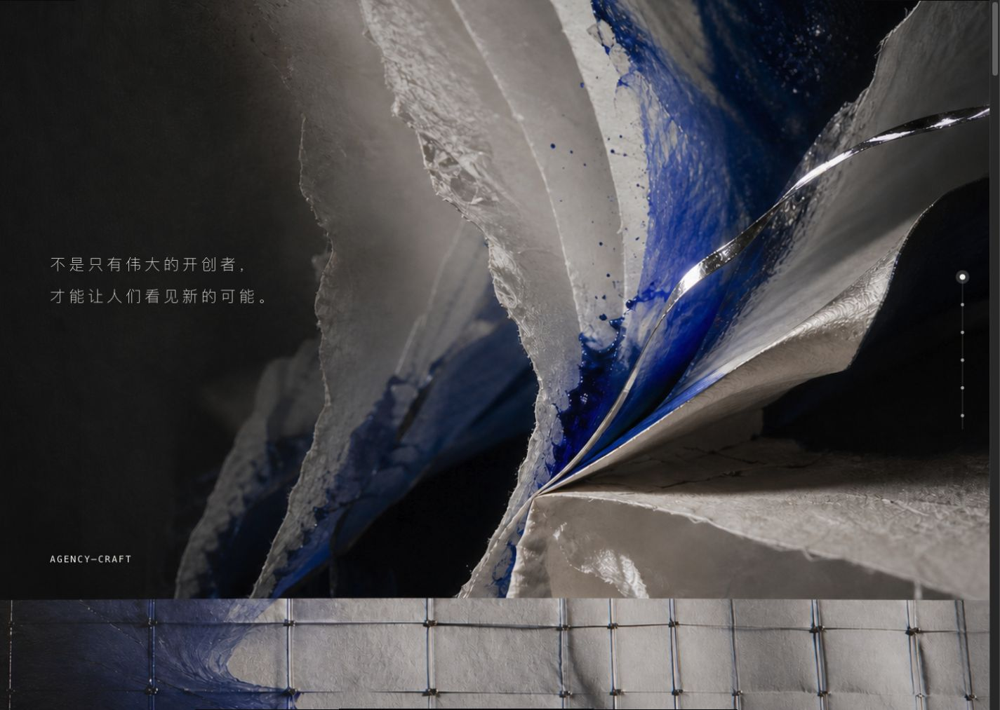 | 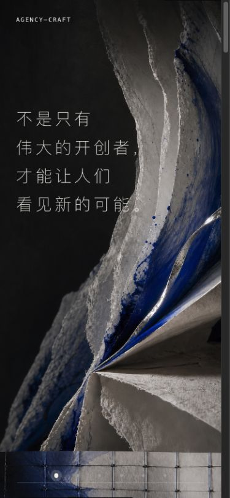 |

银灰、钴蓝、纸张与金属的材质身份稳定；手机裁切也保留了标题和视觉焦点。它不承担新版 Vibe-Flow 的解释任务，可以保留。

### 2. 方向 — 健康，仍是有效的问题入口

| 桌面 | 手机 |
| --- | --- |
|  | 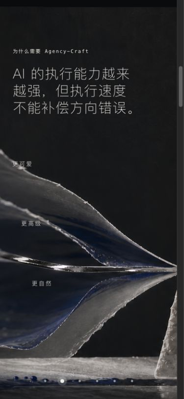 |

“执行速度不能补偿方向错误”仍然成立，并能自然引出人的判断权。较小的漂浮词在复杂背景上存在对比度风险。

### 3. 闭环 — 视觉健康，语义已经过时

| 桌面 | 手机 |
| --- | --- |
| 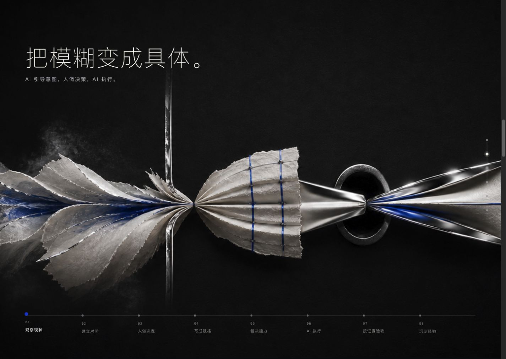 | 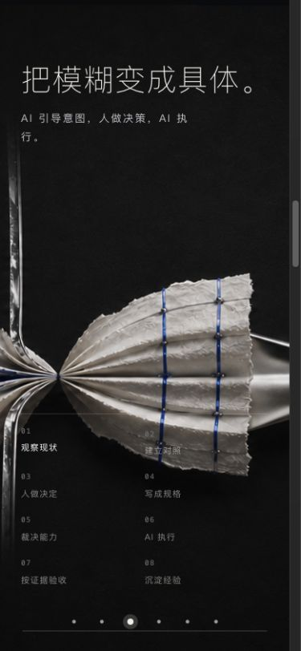 |

八步节奏在桌面和手机上都可读，但“裁决能力”把新版 Flow 的证据分歧、主要矛盾、资源与重排压成了一个泛化节点。这里已不能准确表达项目的方法深度。

### 4. 闸门 — 高影响错位

| 桌面 | 手机 |
| --- | --- |
| 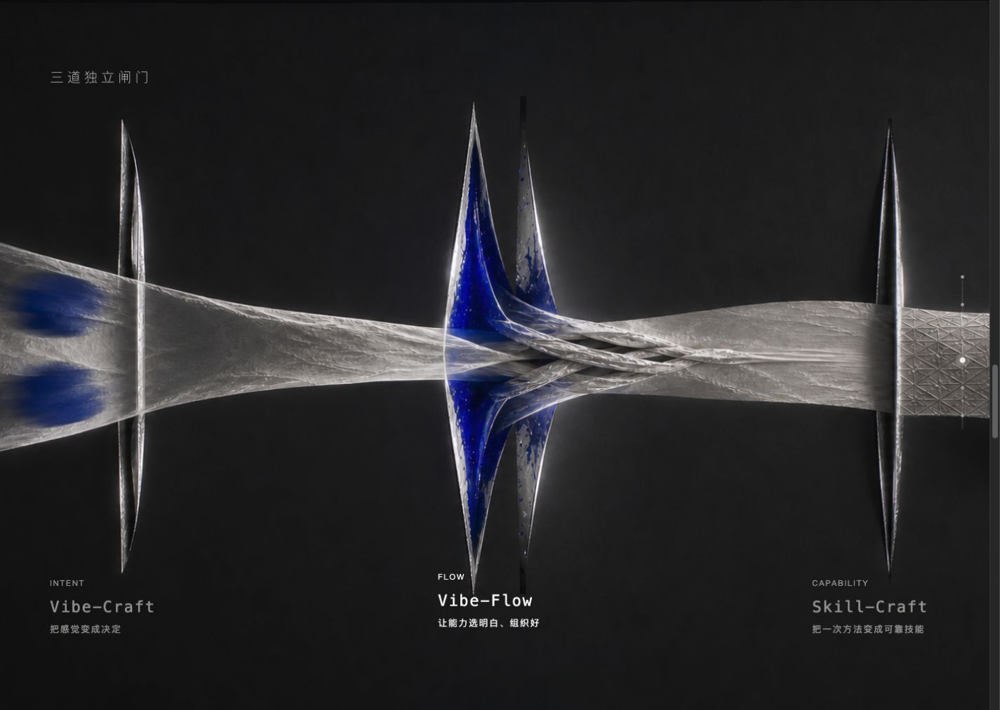 | 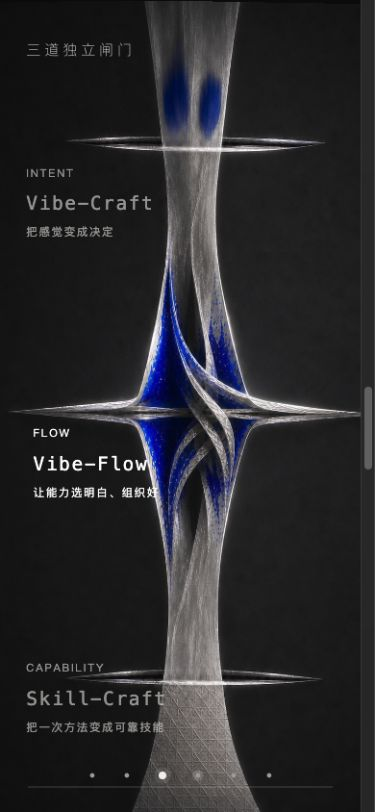 |

三道闸门仍然清楚，但 Flow 只显示“让能力选明白、组织好”。按钮选择会更新按压状态，却不会驱动背景材质或叙事状态，因而交互承诺仍停留在文字高亮。

### 5. 契约 — 高影响事实源漂移

| 桌面 | 手机 |
| --- | --- |
| 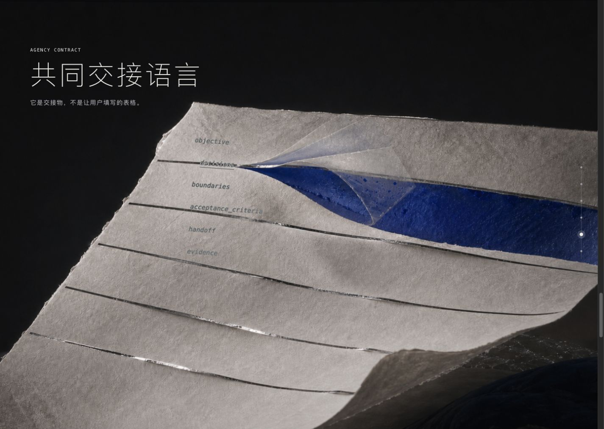 | 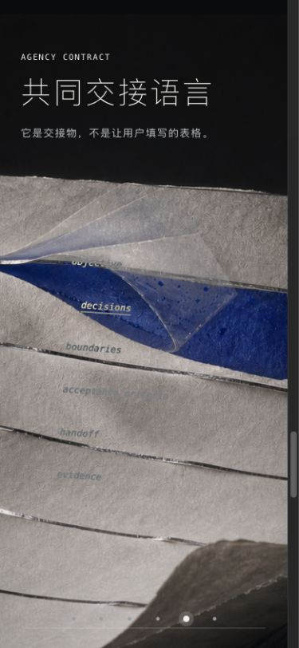 |

官网显示六个字段，但新版 Vibe-Flow 的精确 envelope 明确包含独立 `state.{current,target}`。手机上的字段又叠在高纹理、低对比区域，阅读风险比桌面更高。

### 6. 证据 — 视觉成立，证据闭环落后

| 桌面 | 手机 |
| --- | --- |
| 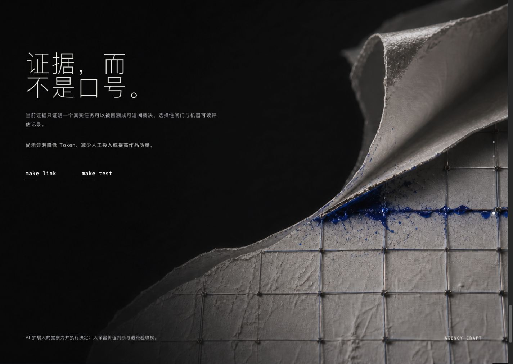 | 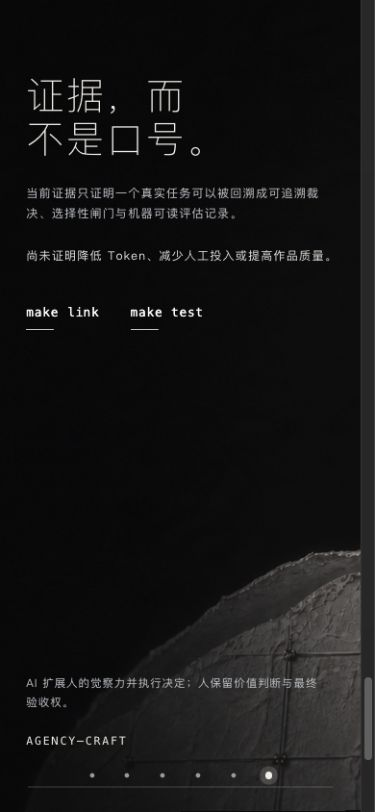 |

谨慎陈述仍然可信，但没有呈现新增加的独立方法案例与 9/9 定向测试，因此结尾比当前项目真实成熟度更弱。手机底部说明文字仍偏小、偏灰。

## 最高影响的三个问题

1. **Flow 的官网定义落后于项目事实。** 当前内容仍像“技能编排器”，没有表达证据任务、主要矛盾、资源与动态重排。
2. **交互没有承载新版方法。** 用户选择闸门或字段时，电影材质没有发生与决策相对应的状态变化。
3. **契约与证据章节出现事实源漂移。** `state` 缺失，新增的独立方法证据没有进入官网收尾。

## 可访问性风险与证据边界

- 可确认的优点：有跳过链接、章节导航的可访问名称、交互按钮的 `aria-pressed` 状态，以及减少动态效果的代码路径。
- 可见风险：多个小字号、低透明度文字叠加在复杂纹理上；手机契约字段与证据说明尤其明显；章节圆点的可见目标很小。
- 截图不能证明完整键盘顺序、屏幕阅读器输出、实际对比度数值或缩放到 200% 时的重排质量，不能据此宣称 WCAG 合规。

## 建议

保留现有六章节、文案基调、银灰钴蓝材质和互动影像身份，只重开受新证据影响的 ideation：让“证据分叉 → 对抗裁决 → 主要矛盾与资源重排 → 可追溯契约”成为一条会随交互改变的电影叙事，并同步修正 Contract 与 Evidence 两个事实源。
